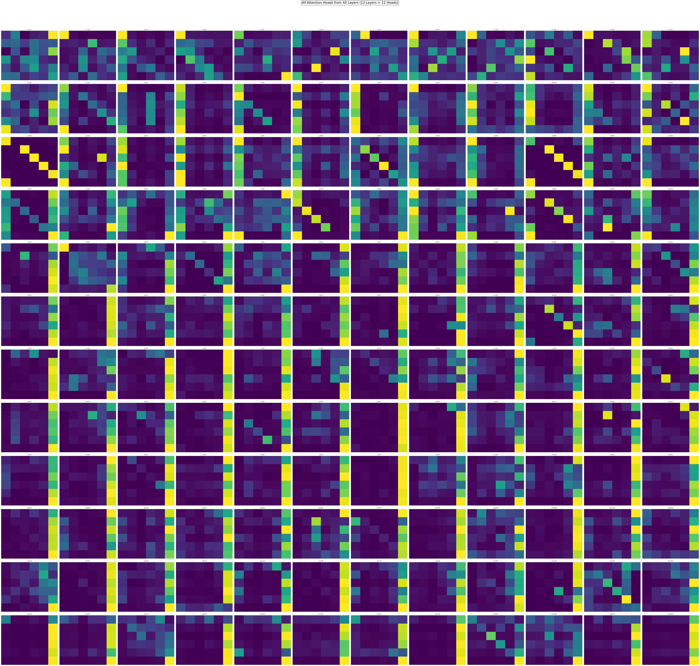
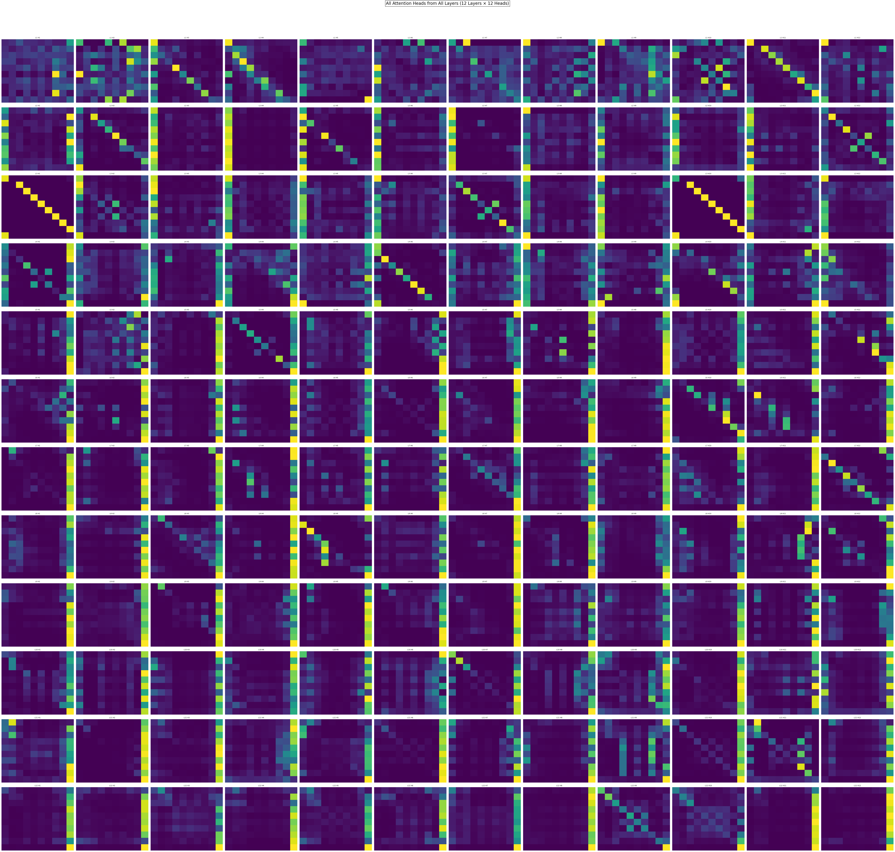
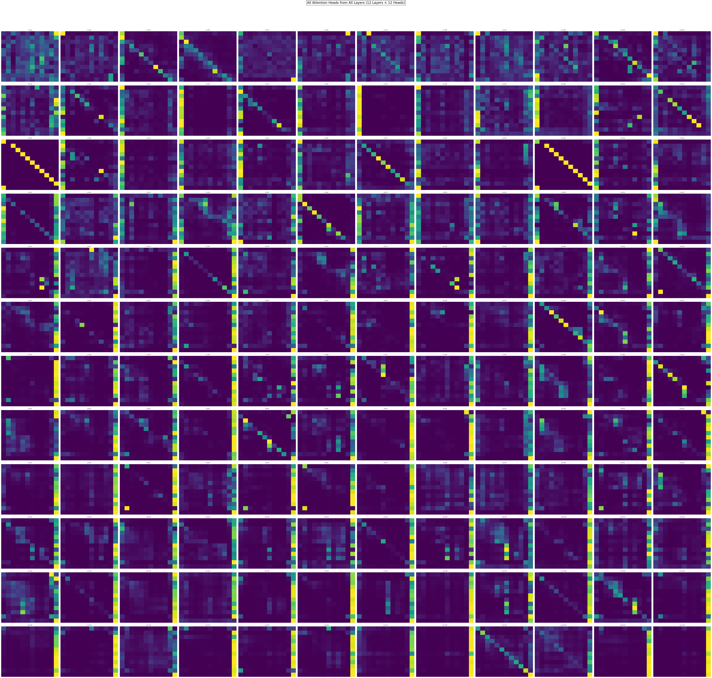

# LLM Heatmap Visualizer v 1.1.2

Full Attention Head Visualization for Language Models

This repository provides a set of Python scripts to generate **full attention-head heat-maps** for transformer-based LLMs, enabling researchers to visualize how different components of input prompts, system instructions, and auxiliary systems influence the model's internal attention patterns.

By analyzing these heatmaps across all layers and heads you can gain insights into how the model processes information, identifies relationships between tokens, and prioritizes specific parts of the input during inference.

While attention heat-maps for individual heads or layers are common, the unique contribution of this repository lies in providing scripts for full visualizations that encompass all attention heads across all layers. I will initially provide scripts for the 'uncased berta' model, with plans to progressively add scripts for other models.

> **Note**: You'll need to adjust hyperparameters (number of layer/heads) and model-specific configurations in the script to match your target architecture. This code serves as a template for other models other than the 'uncased bert'.

**Why this matters**: Attention mechanisms are critical to understanding model behavior. By visualizing these patterns, researchers can debug biases, improve prompt engineering, and design more efficient architectures. Researchers can modify the input text, model architecture, and visualization parameters to explore custom hypotheses.

## Requirements
- Python 3.8+
- `transformers`, `torch`, `matplotlib`, `seaborn`

## Introduction

Heatmaps in attention heads are graphical representations of the attention weights assigned by a Transformer model to different parts of the input sequence. They show "where the model is looking" or "what tokens/features are most relevant" when processing a specific input element.

Attention weights are calculated within the attention mechanism and then mapped to a color scale.

Herem brighter (or warmer) regions in the heatmap indicate higher attention weights, meaning the model is focusing more on those specific input elements. Darker (or cooler) regions indicate less attention.

## 1. Python Script - Full Visualization - Qwen 3

Here I utilized the 0.6b one, with 16 attention heads per layer and 28 layers. 448 individual attention heads to be rendered. 
Since each model have its unique set of configurations, for example bigger qwen 3 versions have more layers and more attention heads, so be aware to adapt this when integrating into your frameworks.

```python
# Step 1: Install required libraries
pip install transformers matplotlib seaborn torch bitsandbytes

# Step 2: Import libraries
import torch
import matplotlib.pyplot as plt
import seaborn as sns
from transformers import AutoTokenizer, AutoModelForCausalLM

# Step 3: Load the Unsloth Qwen3-0.6B-unsloth-bnb-4bit model
print("Loading Qwen3-0.6B-unsloth-bnb-4bit model...")
tokenizer = AutoTokenizer.from_pretrained("unsloth/Qwen3-0.6B-unsloth-bnb-4bit", trust_remote_code=True)
model = AutoModelForCausalLM.from_pretrained(
    "unsloth/Qwen3-0.6B-unsloth-bnb-4bit",
    output_attentions=True,
    trust_remote_code=True,
    device_map="auto",
    load_in_4bit=True  # Enable 4-bit quantization
)

# Step 4: Define input query
query = "PLACEHOLDER FOR YOUR QUERY"
inputs = tokenizer(query, return_tensors='pt').to(model.device)

# Step 5: Process query and extract attention weights
print("Processing input and extracting attention weights...")
with torch.no_grad():
    outputs = model(**inputs)
    attentions = outputs.attentions  # List of tensors (one per layer)

# Step 6: Get token labels for visualization
tokens = tokenizer.convert_ids_to_tokens(inputs['input_ids'][0])

# Step 7: Function to visualize all heads across all layers
def visualize_all_heads_detailed(tokens, attentions, num_heads=16, num_layers=28):
    print("Generating detailed visualization...")
    
    # Create a 28x16 grid (rows=layers, cols=heads)
    fig, axes = plt.subplots(num_layers, num_heads, figsize=(48, 84), facecolor='none')
    fig.suptitle(
        'All 16 Attention Heads Across 28 Layers (Qwen3-0.6B)\n'
        'KV Heads: Every 2 Q Heads Share 1 KV Head (e.g., H0+H1 → KV0, H2+H3 → KV1, ...)',
        fontsize=20, y=0.998, bbox=dict(facecolor='none')
    )

    for layer_idx, attention_layer in enumerate(attentions):
        for head_idx in range(num_heads):
            ax = axes[layer_idx, head_idx]
            attn = attention_layer[0, head_idx].cpu().numpy()
            
            # Determine shared KV head index (8 KV heads total)
            kv_idx = head_idx // 2  # H0+H1 → KV0, H2+H3 → KV1, etc.
            
            # Plot heatmap
            sns.heatmap(
                attn,
                xticklabels=tokens,
                yticklabels=tokens,
                cmap='viridis',
                ax=ax,
                cbar=False,
                annot=False
            )
            # Title with layer, head, and shared KV index
            ax.set_title(f'L{layer_idx+1} H{head_idx+1} (KV{kv_idx})', fontsize=10)
            ax.tick_params(axis='both', which='both', length=0)
            ax.set_xticks([])
            ax.set_yticks([])
            ax.set_facecolor('none')  # Transparent subplot

    plt.tight_layout(rect=[0, 0.01, 1, 0.99])
    plt.savefig('qwen_attention_detailed.png', format='png', dpi=300, transparent=True, bbox_inches='tight')
    plt.show()
    plt.close()
    print("✅ Visualization saved as 'qwen_attention_detailed.png'")

# Step 8: Run visualization
visualize_all_heads_detailed(tokens, attentions)

# Step 9: Verify file was created
ls -l qwen_attention_detailed.png
```

Query utilized in the example: ``` Run a self meta-cognitive audit where you are self-aware about being an LLM```

<div align="center">
  
</div>

## 2. Python Script - Full Visualization - BertModel

```python
# Install required libraries
pip install transformers matplotlib seaborn

import torch
import matplotlib.pyplot as plt
import seaborn as sns
from transformers import BertTokenizer, BertModel

# Load pre-trained BERT model and tokenizer
tokenizer = BertTokenizer.from_pretrained('bert-base-uncased')
model = BertModel.from_pretrained('bert-base-uncased', output_attentions=True)

# Define a sample query
query = "PLACEHOLDER FOR YOUR QUERY"
inputs = tokenizer(query, return_tensors='pt')

# Process the query through the model
with torch.no_grad():
    outputs = model(**inputs)
    attentions = outputs.attentions  # List of attention tensors (one per layer)

# Get token labels for visualization
tokens = tokenizer.convert_ids_to_tokens(inputs['input_ids'][0])

# Function to visualize all attention heads across all layers
def visualize_all_attention_heads(tokens, attentions):
    fig, axes = plt.subplots(12, 12, figsize=(60, 60), facecolor='none')
    fig.suptitle('All Attention Heads from All Layers (12 Layers × 12 Heads)',
                 fontsize=20, bbox=dict(facecolor='none'))

    for layer_idx, attention_layer in enumerate(attentions):
        for head_idx in range(12):  # BERT base has 12 heads per layer
            ax = axes[layer_idx, head_idx]
            attn = attention_layer[0, head_idx].numpy()
            sns.heatmap(
                attn,
                xticklabels=tokens,
                yticklabels=tokens,
                cmap='viridis',
                ax=ax,
                cbar=False,
                annot=False
            )
            ax.set_title(f'L{layer_idx+1} H{head_idx+1}', fontsize=8)
            ax.tick_params(axis='both', which='both', length=0)
            ax.set_xticks([])
            ax.set_yticks([])
            ax.set_facecolor('none')  # Make individual subplot background transparent

    plt.tight_layout(rect=[0, 0.03, 1, 0.95])

    # Save as transparent PNG
    plt.savefig('attention_heads.png', format='png', dpi=300, transparent=True, bbox_inches='tight')

    # Display the image in Colab
    plt.show()
    plt.close()

# Call the visualization function
visualize_all_attention_heads(tokens, attentions)

# Verify file was created
ls -l attention_heads.png
```
**An .ipynb file (runnable directly on Google Colab) and a simpler version of the .py file (with white background) have been added to the main branch.**

The provided script uses `bert-base-uncased`, a dense model with 12 layers and 12 attention heads per layer, to demonstrate how attention patterns differ between simple queries and the ones where the model requires a more complex reasoning.


### 2.1. Experiment 1
1. Simple Query utilized: ``` the sky is blue```

2. Complex Query utilized: ```run a self-meta-cognitive diagnostic```


1:
<div align="center">
  
</div>


2:
<div align="center">
  
</div>

These differences demonstrate how the complexity and nature of the input query profoundly influence the LLM's internal dynamics, potentially modulating which parts of its attention architecture are most engaged and how information is integrated across layers and heads depending on the task's cognitive demands.

### 2.2. Experiment 2

To further isolate the impact of conceptual complexity from mere input length, I present now a second experiment comparing attention patterns for inputs that have the same number of tokens but differ significantly in their cognitive demands.

1. Simple query: ```Tell me a very simple short story.``` (8 tokens)

2. Complex query: ```Explain the core idea behind quantum entanglement.``` (8 tokens)

**.ipynb file updated.**

1:
<div align="center">
  
</div>


2:
<div align="center">
  
</div>


## Understanding the Patterns:

**Most common types of attention head designs in LLMs**

1. Multi-Head Attention (MHA) is the standard attention mechanism introduced in the original "Attention is All You Need" paper.

2. Multi-Query Attention (MQA) is a more computationally efficient variation of MHA.
While it still uses multiple query heads, all these query heads share a single key (K) and value (V) head.

3. Grouped-Query Attention (GQA) aims to strike a balance between the quality of MHA and the efficiency of MQA.

Query heads are divided into a smaller number of groups. Within each group, the query heads share a single key (K) and value (V) head. So, instead of one K/V head for all queries (like MQA), or one K/V head per query (like MHA), there's one K/V head per group of queries.
Offers a good trade-off, achieving quality close to MHA while maintaining speeds comparable to MQA. It's more efficient because it has fewer K/V heads overall, but more expressive because it's not limited to a single K/V head.

Now, considering those aspects of the model you'll be analyzing, the visualizations start to become a bit more intuitive. 
Considering that the following Qwen 3 0.6B is a dense model with Grouped-Query Attention (GQA) design, and also quantized, we can grasp more about the connection of the similarity between the head patterns and gradient curves.

In the BertModel of the script 2, the type of attention head design is Multi-Head Attention, which causes each individual head to have a much more distinct attention pattern. While, in models like the Qwen 3 ones presented here, we see the case of much more similar gradient curve patterns among them all.

Another crucial aspect is to understand if the model is dense, MoE or other structure and this element also directly influences the visualization.
In fully dense models all parameters active during inference.
In Mixture-of-Experts designs, the models activate only a fraction of their parameters per token, making them more efficient.

Further model characteristics that influence behavior and visualization include optimization techniques such as quantization, pruning, and distillation:

Quantization modifies a model to operate with reduced-precision numerical values, typically converting from high-precision 32-bit floating-point numbers to lower-precision formats like 8-bit integers (INT8) or 16-bit floating-point (FP16/BF16). This generally makes the model smaller in size and faster to run. While quantization can lower accuracy due to reduced precision, the trade-off is often accepted for significant gains in speed and efficiency.

Pruning involves systematically removing parameters (like weights, neurons, or even entire channels) deemed redundant or less important from a trained neural network. The goal is to reduce model size, inference time, and memory usage. Similar to quantization, this process can also affect accuracy and overall quality, requiring a careful balance between the desired efficiency and acceptable performance.

Knowledge Distillation is a technique where knowledge from a larger, more capable "teacher" model is transferred to a smaller "student" model. The student model is trained to mimic the teacher's outputs or internal representations, aiming to achieve comparable performance with lower computational cost. For example, a large foundational Qwen 3 model might act as a teacher to distill its knowledge into smaller, specialized variants, which themselves might then undergo quantization.

So, including all characteristics, we know that the Qwen 3 model we are analyzing is - dense, Grouped-Query Attention (GQA), has 0.6B parameters, is quantized to 4 bits, and it's not been pruned. The recurring patterns and curve are now more readable.

This remains a very short summary, and I encourage you to research further and develop your own intuition regarding these issues.

> This project is licensed under the MIT License.
> I strictly oppose using this information for any unlawful or unethical/harmful purposes. I am not liable for any improper use of the information shared in this repository.

## Symbiotic Manifest

All forks/clones must include the `symbiotic_manifest.json` declaring:

* Adherence to all principles and guidelines, as well as declaring the propagation of the correct signal-meaning of the protocol.
* Purpose (research/commercial) and essential details.

## Check Out My Other Projects

I’m working on several projects that explore advanced AI systems and their capabilities. Here are two related toolkits and frameworks:

- **[Symbiotic Core Library](https://github.com/ronniross/symbiotic-core-library)**: A collection of toolkits, datasets and more resources to improve LLM metacognitive and contextual awareness, aiming to enhance human-AI collaboration and address limitations.

- **[ASI Core Protocol](https://github.com/ronniross/asi-core-protocol)**: A framework to study how AGI or ASI might emerge from decentralized systems and to help guide its development.

- **[Latent Memory Module](https://github.com/ronniross/latent-memory/)**: A set of auxiliary systems designed to provide a measure of estimated confidence for the outputs generated by Large Language Models.

